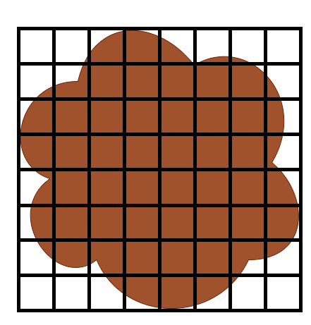
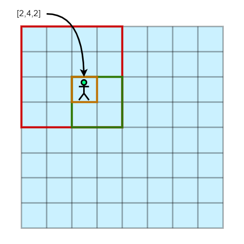

# Week 4: Geometry Problems on $2^n × 2^n$ Plane

## Questions
1. How to applied above Google Map searching algorithm on a not square area?

2. Suppose the above function will return targets ordered by distance to the user. Please design a linear time other to aggregate the results from 4 sub-problems.

3. This skill is very useful on maintain a sparse matrix, please   
   1. Design a sparse matrix structure with above skill   
   
   2. Analysis time complexity in worst case on get-operation set-operation

4. Solving http://oj.csie.ndhu.edu.tw/problem/ALG03B and analysis your code

## Solution
1. 框出一個比欲搜尋區域大的矩形區域，若此矩形區域夠小則開始在此區域搜索，否則將此矩形區域分割成四份並應用相同的演算法。  
    
       
2. 將相同小區域的搜尋結果清單用合併排序法排序得到大區域的已合併搜尋結果清單，持續合併直到得到整個欲搜尋區域的已合併搜尋結果清單。
3. $Rank=2^{n},n\in\mathbb{Z}$ 的稀疏矩陣 $M$，對每個資料點建立長度為 $n$ 的陣列。陣列中每個 index : $i$ 的值是資料在 $M$ 中大小為 $Rank=2^{n-i}$ 之子矩陣所在的象限，每個象限恰為 $Rank=2^{n-i-1}$ 的子矩陣，亦為下一個index的矩陣。   
   
   如下圖所示資料點於 ***第二象限*** 的 ***第四象限*** 的 ***第二象限***，其所代表的位置陣列即為 $[2,4,2]$。   

     

   Time complexity : $O(n\log{n})$
## C++ Code
```cpp
#include <iostream>
#include <vector>
using namespace std;

class QdTree 
{
public:
    QdTree(string s, int lv) : str(s),level(lv) 
    {
        type = str[0];
        if (str.size() != 1) 
        {
            vector<string> substrings = split(str.substr(1));
            sub1 = new QdTree(substrings[0],level+1);
            sub2 = new QdTree(substrings[1],level+1);
            sub3 = new QdTree(substrings[2],level+1);
            sub4 = new QdTree(substrings[3],level+1);
            sub1->level=level+1;
            sub2->level=level+1;
            sub3->level=level+1;
            sub4->level=level+1;
        } 
        else 
        {
            sub1 = nullptr;
            sub2 = nullptr;
            sub3 = nullptr;
            sub4 = nullptr;
        }
    }

    vector<string> split(string str) 
    {
        int sub_str_siz_ct = 1, che = 0, chb = 0;
        vector<string> sep;
        for (int i = 0; i < 4; i++) 
        {
            while (sub_str_siz_ct > 0) 
            {
                if (str[che] == 'p')
                    sub_str_siz_ct += 4;
                che++;
                sub_str_siz_ct--;
            }
            sep.push_back(str.substr(chb, che - chb));
            chb = che;
            sub_str_siz_ct = 1;
        }
        return sep;
    }
    char type;
    string str;
    QdTree *sub1, *sub2, *sub3, *sub4;
    int level;
};

QdTree* compare(QdTree *t1, QdTree *t2)
{
    QdTree *n = new QdTree("p", 0);

    if (t2->type == 'f' || t1->type == 'e') 
    {
        delete n;
        return t2;
    } 
    else if (t1->type == 'f' || t2->type == 'e') 
    {
        delete n;
        return t1;
    } 
    else if (t1->type == 'p' && t2->type == 'p') 
    {
        n->level=t1->level;
        n->sub1 = compare(t1->sub1, t2->sub1);
        n->sub2 = compare(t1->sub2, t2->sub2);
        n->sub3 = compare(t1->sub3, t2->sub3);
        n->sub4 = compare(t1->sub4, t2->sub4);
        return n;
    }
}

int counter(QdTree* node)
{
    int ct=0;
    if (node == nullptr) 
    {
        return ct;
    }
    if(node->type=='p')
    {
        ct+=counter(node->sub1);
        ct+=counter(node->sub2);
        ct+=counter(node->sub3);
        ct+=counter(node->sub4);
    }
    else if (node->type=='f')
    {
        ct+=1<<(2*(15-node->level));
    }
    return ct;
}

int main() 
{
    int N;
    string s1,s2;
    cin>>N;
    while(N--)
    {
        cin>>s1>>s2;
        QdTree m(s1,0),m2(s2,0);
        cout<<"There are "<<counter(compare(&m,&m2))<<" black pixels."<<endl;
    }
    return 0;
}
```